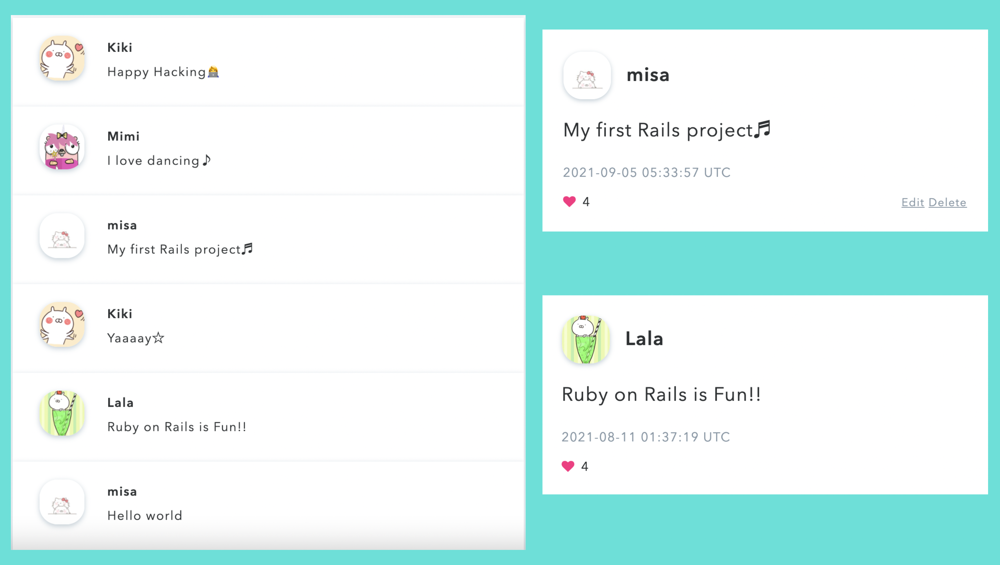
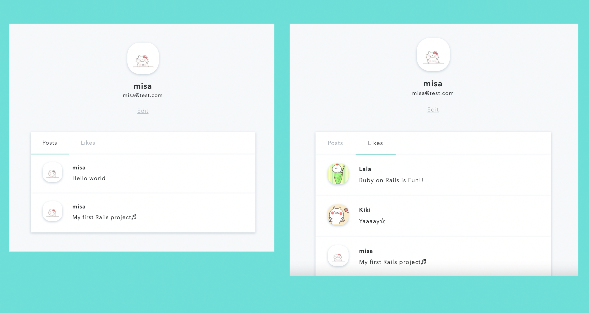

# Tweetie

An app that allows users to post tweets.
This is my first Ruby project.
 
Tweetie: https://tweetieapp.herokuapp.com

## Technologies Used:
- Ruby / Ruby on Rails
- SCSS
- Sqlite3 (postgreSQL for production)

## Others
- Developed using a RESTful API server in Ruby on Rails.
- Built a front end interface, and created a user authentication function with Ruby on Rails.
- Deployed to Heroku.